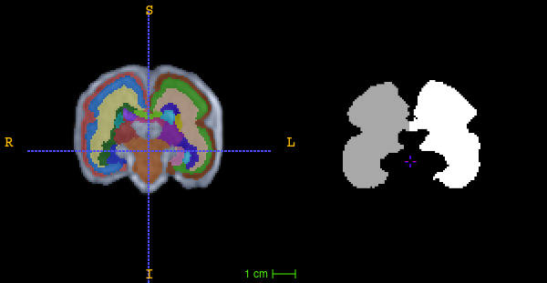

# LGD White Matter Masking

[](https://hub.docker.com/r/fnndsc/pl-lgd-hemis)
[](https://github.com/FNNDSC/pl-lgd-hemis/blob/main/LICENSE)
[](https://github.com/FNNDSC/pl-lgd-hemis/actions/workflows/ci.yml)



`pl-lgd-hemis` is a [_ChRIS_](https://chrisproject.org/)
_ds_ plugin which creates left and right hemisphere white matter
masks from segmentations.

Its hard-coded mappings are as follows:

| anatomical region   | mapped classification |
|---------------------|-----------------------|
| cortical plate      | grey matter           |
| CSF                 | CSF                   |
| brain stem          | CSF                   |
| midbrain            | CSF                   |
| cerebellum          | CSF                   |
| Clear Label         | background            |
| everything else     | white matter          |

## Installation

`pl-lgd-hemis` is a _[ChRIS](https://chrisproject.org/) plugin_, meaning it can
run from either within _ChRIS_ or the command-line.

[](https://chrisstore.co/plugin/pl-lgd-hemis)

## Local Usage

To get started with local command-line usage, use [Apptainer](https://apptainer.org/)
(a.k.a. Singularity) to run `pl-lgd-hemis` as a container:

```shell
apptainer exec docker://fnndsc/pl-lgd-hemis lgd_hemis input/ output/
```

To print its available options, run:

```shell
apptainer exec docker://fnndsc/pl-lgd-hemis lgd_hemis --help
```

`lgd_hemis` requires two positional arguments: a directory containing
input data, and a directory where to create output data.

The input directory is expected to contain subject folders where each
folder contains exactly two MINC volumes: segmentation and T1/T2 image.
For each subject folder input, an output folder is created containing
`wm_left.mnc` and `wm_right.mnc`.
